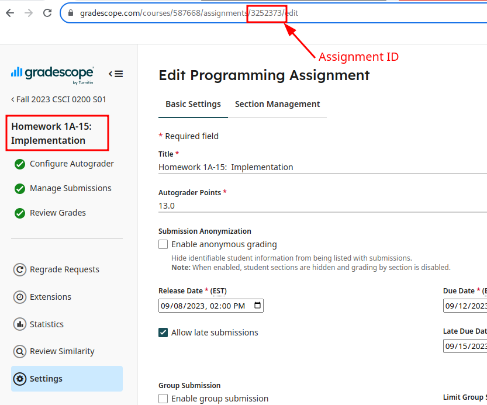

# Autograder support utilities

This directory contains files to support the autograder.  

This directory is organized as follows:
 - `config.json`:  Environment configuration for the autograder.  This
   file is read each time the autograder is run, and contains a map of
   assignment IDs to configurations.  **Be careful modifying this
   file!**   See the next section for information


## Gradescope environment config

The file `config.json` is read by the autograder to know where to find
the code for different assignments.  For examples, take a look at this
file--old versions of the file are included in the `archive`
directory.

Each assignment--where "assignment" is one a gradescope assignment,
ie. a thing you can submit to on gradescope)--has a configuration
block with the following fields:
 - `name`: Friendly name for this assignment.  Used by `local_run` and
   other scripts to lookup this assignment by name
 - `id`:  Gradesope ID for this assignment.  Must match the ID of the
   assignment in Gradescope.  Every semester, you must change this
   number to match your assignment.  See below for instructions on how
   to find your assignment ID.
 - `target`: Path to a script to run for this assignment.  The loader
   will pass information to this script via several arguments--see
   `do_run.sh` for details.  You can extend `do_run.sh` to run each
   assignment's autograder (recommended), or replace it with your own
   script.
 - `command`:  Arbitrary string argument that will be passed to the
   target program.  You can use this to select different run
   configurations for different gradescope assignments that use the
   same script (eg. "milestone" submissions for intermediate
   deadlines, which only run subsets of the tests)
 
Here's an example of the configuration for each assignment:

```
    "assignments": [
	{
	    "name": "snowcast-milestone",
	    "id": 3252373,
	    "path": "do_run.sh",
	    "command": "snowcast-milestone"
	},
	{
	    . . .             # Next assignment here...
	}
```

After you modify `config.json`, be sure to test the changes by running
the autograder locally with `local_run`.

> [!CAUTION]
> Do not skip this step, as it is extremely important to make sure
> this file is formatted properly.  This file is ready by *every
> single autograder*--if your file is formatted improperly, none of
> the autograders will work!

After you are sure you can run your new assignment, commit and push
your changes.

## Testing the autograder locally

You can use the script `local_run`, found in the main directory of the
loader repository--see the README in that repository for details.

## Finding the assignment ID

Gradescope assigns each assignment a unique Assignment ID.  The
autograder looks up this value to find which assignment to run.

When creating a new assignment (ie, every semester), you need to look
up the assignment ID and copy it here.  You can find this value in the
URL bar when viewing any page for that assignemnt, (eg. the "Settings"
or "View submissions" page).  For example, here is where to find the
assignment ID for `hw01a-15`, as shown in the example above:



After you find the assignment ID, you should copy it to the `id`
parameter in the assignment's config block.
